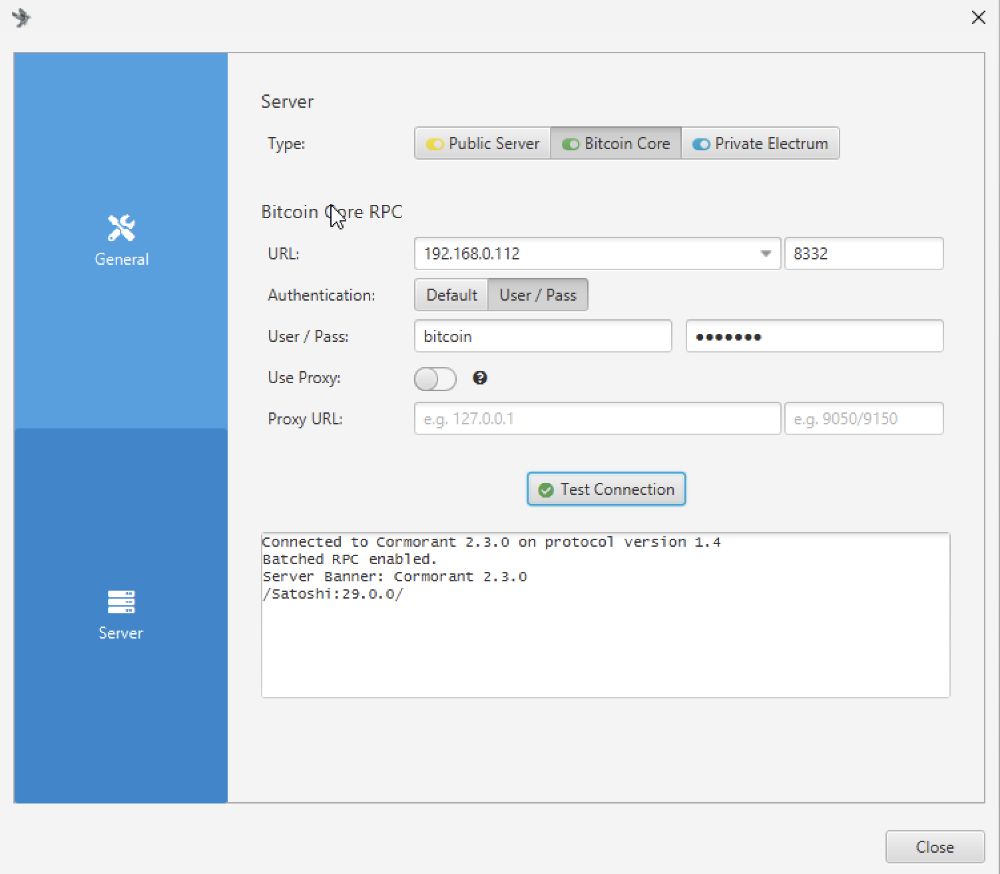

- [ ] how to interupt process (ctrl + c)
- [ ] อธิบายแบบ user password ก่อน (why we should set rpcuser and rpcpassword answer authentication when call rpc)
- [ ] แล้วบอกว่ามันเสี่ยงยังไง (password stay in plain text if anyone can open your bitcoin.conf they can see your password, or you use git,or backup your bitcoin.conf to cloud service, someone can see your password)
- [ ] แล้วทำไมควรใช้ auth (hashed password, if anyone can open you bitcoin.conf they can't see your password, they can see only hashed password must brute force to get your password)

- [ ] แล้วบอกวิธี generate auth
- [ ] connect sparrow wallet

## 1. rpcuser and rpcpassword

### 1.1 Open your bitcoin.conf file

```bash
$ nano ~/.bitcoin/bitcoin.conf
```

### 1.2 Add rpcuser and rpcpassword to your bitcoin.conf file

```conf
rpcuser=your_rpc_username
rpcpassword=your_rpc_password
```

Then save and exit (Ctrl + X, Y, Enter)

### 1.3 Restart bitcoind

```bash
$ sudo systemctl restart bitcoind.service
```

### 1.4 Check the status of bitcoind

```bash
$ sudo systemctl status bitcoind.service
● bitcoind.service - Bitcoin daemon
     Loaded: loaded (/etc/systemd/system/bitcoind.service; enabled; preset: enabled)
     Active: active (running) since Mon 2025-10-06 00:27:54 +07; 7s ago
    Process: 52385 ExecStart=/usr/local/bin/bitcoind -daemon -conf=/home/pi/.bitcoin/bitcoin.conf -datadir=/home/pi/.bitcoin (code=exited, status=0/SUCCESS)
   Main PID: 52387 (bitcoind)
      Tasks: 25 (limit: 9572)
        CPU: 8.349s
     CGroup: /system.slice/bitcoind.service
             └─52387 /usr/local/bin/bitcoind -daemon -conf=/home/pi/.bitcoin/bitcoin.conf -datadir=/home/pi/.bitcoin

Oct 06 00:27:54 raspberrypi systemd[1]: Starting bitcoind.service - Bitcoin daemon...
Oct 06 00:27:54 raspberrypi bitcoind[52385]: Bitcoin Core starting
Oct 06 00:27:54 raspberrypi systemd[1]: Started bitcoind.service - Bitcoin daemon.
```

### 1.5 Check the log file for any error

```bash
$ tail -f ~/.bitcoin/debug.log

2025-10-05T17:28:02Z Progress loading mempool transactions from file: 80% (tried 765, 191 remaining)
2025-10-05T17:28:02Z Progress loading mempool transactions from file: 90% (tried 861, 95 remaining)
2025-10-05T17:28:02Z Imported mempool transactions from file: 956 succeeded, 0 failed, 0 expired, 0 already there, 0 waiting for initial broadcast
2025-10-05T17:28:02Z initload thread exit
2025-10-05T17:28:10Z New block-relay-only v1 peer connected: version: 70016, blocks=917790, peer=0
2025-10-05T17:28:14Z New block-relay-only v2 peer connected: version: 70016, blocks=917790, peer=1
2025-10-05T17:28:18Z New outbound-full-relay v1 peer connected: version: 70016, blocks=917790, peer=2
...
...

```

### 1.6 Test connection

#### 1.6.1 in raspberry pi5

```bash
$ bitcoin-cli help getblockchaininfo
getblockchaininfo

Returns an object containing various state info regarding blockchain processing.

Result:
{                                         (json object)
    ...
}

Examples:
> bitcoin-cli getblockchaininfo
> curl --user myusername --data-binary '{"jsonrpc": "2.0", "id": "curltest", "method": "getblockchaininfo", "params": []}' -H 'content-type: application/json' http://127.0.0.1:8332/
```

> [!NOTE]
> change myusername to your rpcuser

then use curl to test the connection

```bash
$ curl --user bitcoin --data-binary '{"jsonrpc": "2.0", "id": "curltest", "method": "getblockchaininfo", "params": []}' -H 'content-type: application/json' http://127.0.0.1:8332/
Enter host password for user 'bitcoin':
{"jsonrpc":"2.0","result":{"chain":"main","blocks":917790,"headers":917790,"bestblockhash":"000000000000000000006de1fc99f94542df01a6f763667d2579ea28c3e293ef","bits":"1701ddb4","target":"00000000000000000001ddb40000000000000000000000000000000000000000","difficulty":150839487445890.5,"time":1759685040,"mediantime":1759683880,"verificationprogress":0.9999995424657299,"initialblockdownload":false,"chainwork":"0000000000000000000000000000000000000000e8c87f09711580793a23c607","size_on_disk":786852089923,"pruned":false,"warnings":[]},"id":"curltest"}
```

#### 1.6.2 test from your computer (For MacOS or Linux)

> [!NOTE]
> Windows users can use WSL to run Bash commands. It’s out of scope for this course, but if you’d like to try it, there is documentation available in the repository.

find your raspberry pi ip address

```bash
$ ping raspberrypi.local
PING raspberrypi.local (192.168.0.112): 56 data bytes
64 bytes from 192.168.0.112: icmp_seq=0 ttl=64 time=190.722 ms
64 bytes from 192.168.0.112: icmp_seq=1 ttl=64 time=251.044 ms

--- raspberrypi.local ping statistics ---
2 packets transmitted, 2 packets received, 0.0% packet loss

```

then run curl command from your computer

```bash
$ curl --user <rpcuser> --data-binary '{"jsonrpc": "2.0", "id": "curltest", "method": "getblockchaininfo", "params": []}' -H 'content-type: application/json' http://<raspberry_pi_ip>:8332/
```

```bash
$ curl --user bitcoin --data-binary '{"jsonrpc": "2.0", "id": "curltest", "method": "getblockchaininfo", "params": []}' -H 'content-type: application/json' http://192.168.0.112:8332/
Enter host password for user 'bitcoin':
{"jsonrpc":"2.0","result":{"chain":"main","blocks":917792,"headers":917792,"bestblockhash":"000000000000000000019a51df6099ceee18c44eaa36a2bd6a538192e29b1c2d","bits":"1701ddb4","target":"00000000000000000001ddb40000000000000000000000000000000000000000","difficulty":150839487445890.5,"time":1759685417,"mediantime":1759684830,"verificationprogress":0.9999975536979354,"initialblockdownload":false,"chainwork":"0000000000000000000000000000000000000000e8c9916a9f992601df65ae39","size_on_disk":786855725137,"pruned":false,"warnings":[]},"id":"curltest"}
```

#### 1.6.3 test from sparrow wallet

open sparrow wallet and go to settings (mac `Cmd + ,` , windows `Ctrl + ,`)

in settings click on "Server" tab

in settings you set

```
Type: Bitcoin Core
Bitcoin CoreRPC
URL: `<ip_address>:<port>` # your raspberry pi ip address (use ping command to find your raspberry pi ip address)
Authentication: User/Pass
User/Password: `<rpcuser> <rpcpassword>` # your rpcuser and rpcpassword
UseProxy: False
Proxy URl:
```

then click "Test Connection" button you should see like this



## 2. rpcauth

rpcauth is more secure than rpcuser and rpcpassword because it use hashed password it looks like this

```conf
rpcauth=<username>:<hashed_password>
```

### 2.1 How to generate rpcauth

2.1.1 Go to [https://github.com/bitcoin/bitcoin/blob/master/share/rpcauth/rpcauth.py](https://github.com/bitcoin/bitcoin/blob/master/share/rpcauth/rpcauth.py)
2.1.2 Click "Raw" button to get the raw python script
2.1.3 use `wget` to get the script to your raspberry pi

```bash
$ cd ~ # go to your home directory
$ wget https://raw.githubusercontent.com/bitcoin/bitcoin/refs/heads/master/share/rpcauth/rpcauth.py

# you should see rpcauth.py in your current directory
$ ls
Desktop  Documents  Downloads  rpcauth.py
```

2.1.4 run the script with your desired username and password

```bash
python3 rpcauth.py <your_username> <your_password>
```

```bash
$ python3 rpcauth.py test test
String to be appended to bitcoin.conf:
rpcauth=test:d4951c8a7434864791b284f1ab418eba$8ad6f178fdfa62f926cde43966ec1eadf6f3f5bb0afb5baed0b1dcbafba7f9d7
Your password:
test
```

2.1.5 Copy the output and paste it into your bitcoin.conf file

```conf
# --snip--

rpcauth=test:59404178f93dda796d92c472090a5262$e12eb787cf0eef56bc8589342cfdf428a361370403c031d51bf4c73fa6bb9bf3

# --snip--
```

### 2.3 After set rpcauth

2.3.1 After set rpcauth in bitcoin.conf, restart bitcoind

```bash
systemctl restart bitcoind.service
```

2.3.2 Check the status of bitcoind

```bash
systemctl status bitcoind.service
```

2.3.3 Check the log file for any error

```bash
tail -f ~/.bitcoin/debug.log
```

### 2.4 Test connection after set rpcauth

#### 2.4.1 in raspberry pi5

```bash
$ bitcoin-cli help getblockchaininfo
getblockchaininfo

Returns an object containing various state info regarding blockchain processing.

Result:
{
....
}
Examples:
> bitcoin-cli getblockchaininfo
> curl --user myusername --data-binary '{"jsonrpc": "2.0", "id": "curltest", "method": "getblockchaininfo", "params": []}' -H 'content-type: application/json' http://127.0.0.1:8332/

```

> change myusername to your rpcauth username

then use curl to test the connection

```bash
$ curl --user bitcoin --data-binary '{"jsonrpc": "2.0", "id": "curltest", "method": "getblockchaininfo", "params": []}' -H 'content-type: application/json' http://127.0.0.1:8332/
Enter host password for user 'bitcoin':
{"jsonrpc":"2.0","result":{"chain":"main","blocks":915753,"headers":915753,"bestblockhash":"000000000000000000011aaa8e85e4831815b6f18340ef2d56ea3884a6301b30","bits":"1701fa38","target":"00000000000000000001fa380000000000000000000000000000000000000000","difficulty":142342602928674.9,"time":1758470427,"mediantime":1758466112,"verificationprogress":0.999993927355762,"initialblockdownload":false,"chainwork":"0000000000000000000000000000000000000000e4b2f04f4c9fb655ba731930","size_on_disk":783353282429,"pruned":false,"warnings":[]},"id":"curltest"}
```

#### 2.4.2 test from your computer (For MacOS or Linux)

> [!NOTE]
> Windows users can use WSL to run Bash commands. It’s out of scope for this course, but if you’d like to try it, there is documentation available in the repository.

find your raspberry pi ip address

```bash
$ ping raspberrypi.local
PING raspberrypi.local (192.168.0.112): 56 data bytes
64 bytes from 192.168.0.112: icmp_seq=0 ttl=64 time=61.313 ms # 192.168.0.112 is my raspberry pi ip address
64 bytes from 192.168.0.112: icmp_seq=1 ttl=64 time=13.027 ms

--- raspberrypi.local ping statistics ---
2 packets transmitted, 2 packets received, 0.0% packet loss
round-trip min/avg/max/stddev = 13.027/37.170/61.313/24.143 ms
```

> [!NOTE]
> use `ping` to find the ip address of your raspberry pi

run curl command from your computer

```bash
curl --user <username> --data-binary \
'{"jsonrpc": "2.0", "id": "curltest", "method": "getblockchaininfo", "params": []}' -H 'content-type: application/json' \
http://<raspberry_pi_ip>:8332/
```

```bash
$ curl --user test --data-binary '{"jsonrpc": "2.0", "id": "curltest", "method": "getblockchaininfo", "params": []}' -H 'content-type: application/json' http://192.168.0.112:8332/
{"jsonrpc":"2.0","result":{"chain":"main","blocks":915753,"headers":915753,"bestblockhash":"000000000000000000011aaa8e85e4831815b6f18340ef2d56ea3884a6301b30","bits":"1701fa38","target":"00000000000000000001fa380000000000000000000000000000000000000000","difficulty":142342602928674.9,"time":1758470427,"mediantime":1758466112,"verificationprogress":0.9999928627030699,"initialblockdownload":false,"chainwork":"0000000000000000000000000000000000000000e4b2f04f4c9fb655ba731930","size_on_disk":783353282429,"pruned":false,"warnings":[]},"id":"curltest"}
```

#### 2.4.3 test from sparrow wallet

Open sparrow wallet and go to settings then Click on "Server" tab and set like this

```
Server
Type: Bitcoin Core

Bitcoin CoreRPC
url: <ip_address>:<port> # your raspberry pi ip address
Authentication: User/Pass
User/Password: <username> <password> # your rpcuser and rpcpassword or rpcauth username and password
UseProxy: False
Proxy URl:
```

Click test connection you should see like this (same as rpcuser and rpcpassword)

```
Connected to Cormorant 2.1.3 on protocol version 1.4
Batched RPC enabled.
Server Banner: Cormorant 2.1.3
/Satoshi:29.0.0/
```
