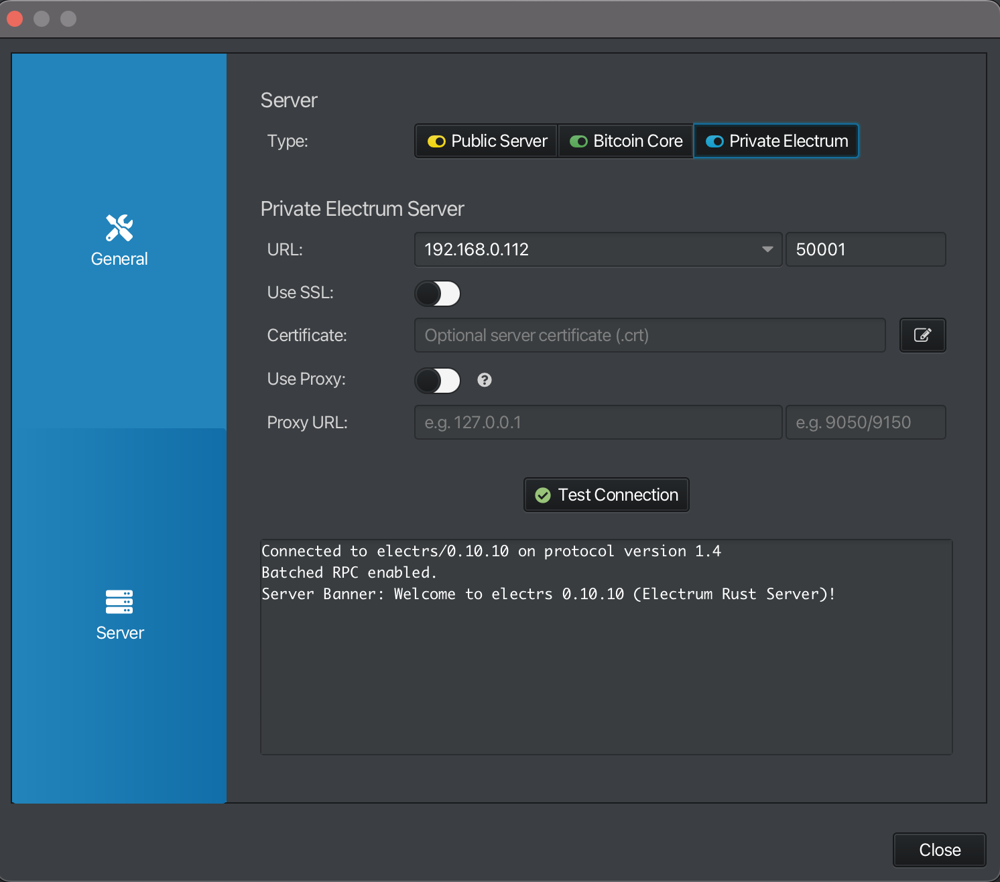
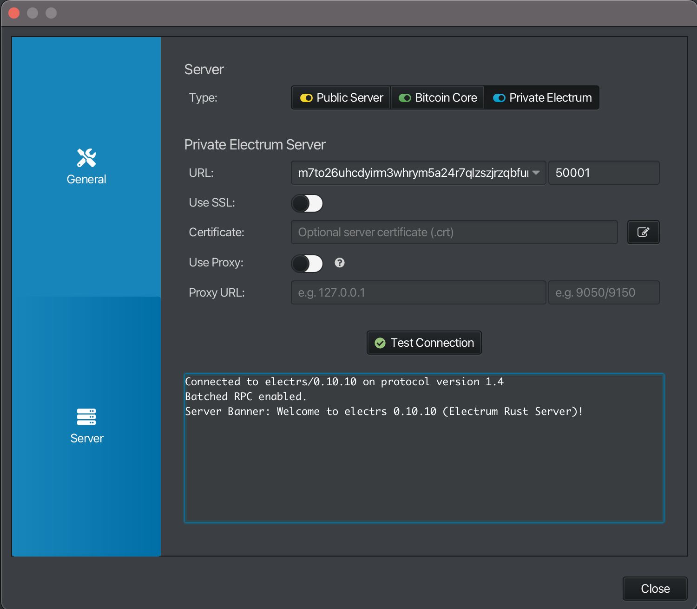

Install Electrum Server บน Node เรา

- [ ] เพื่อประโยชน์ด้าน Privacy (กรณีใช้งานมากกว่า 1คน)
- [ ] เพื่อทำให้ Node ต่อ treazor nunchak, และอื่นๆได้
      Wallet
      connect wallet
- [ ] what is Electrum Server
  - Electrum Server คืออะไร
  - ทำไมต้องใช้ Electrum Server
  - Electrum Server vs Bitcoin Core RPC

should teach install before tell student what is electrum server and why use it because electrs building take time (~20 mins)

## 1. Install Cago and Rust to build Electrs

### 1.2 uninstall rust and cargo if you have old version

```bash
$ dpkg -l | grep rust
# should not have any rust version below 1.63
$ sudo apt remove --purge libstd-rust-1.63 libstd-rust-dev
$ sudo apt autoremove
```

> [!NOTE] > `dpkg -l` : Lists all installed packages on the system (from APT) <br> > `sudo apt remove vlc` : ลบ VLC ออก แพ็กเกจเสริมของ program VLC จะ ยังคงอยู่ในเครื่อง<br> > `sudo apt autoremove` : ลบแพ็กเกจเสริมที่ไม่ได้ใช้งานแล้วออก<br>

### 1.3 install rust and cargo from [https://www.rust-lang.org/tools/install](https://www.rust-lang.org/tools/install)

```bash
curl --proto '=https' --tlsv1.2 -sSf https://sh.rustup.rs | sh
```

### 1.4 check rust and cargo version

```bash
$ which rustc
/home/pi/.cargo/bin/rustc
$ which cargo
/home/pi/.cargo/bin/cargo
$ rustc --version
rustc 1.89.0 (29483883e 2025-08-04)
$ cargo --version
cargo 1.89.0 (c24e10642 2025-06-23)
```

---

## 2. Install Electrs

### 2.1. go to [github electrs](https://github.com/romanz/electrs) click doc then click install.md

```bash
$ sudo apt update
$ sudo apt install -y build-essential libclang-dev git # not install cargo
$ git clone https://github.com/romanz/electrs
$ cd electrs
$ cargo build --locked --release
$ ./target/release/electrs --version  # should print the latest version
```

### 2.2 Configure Firewall to allow Electrs

```bash
$ sudo ufw allow 50001/tcp comment 'allow electrs TCP from anywhere'
$ sudo ufw allow 50002/tcp comment 'allow electrs SSL from anywhere'
$ sudo ufw reload
Firewall reloaded
$ sudo ufw status
To                         Action      From
--                         ------      ----
...
50002/tcp                  ALLOW       Anywhere                   # allow electrs SSL from anywhere
50001/tcp                  ALLOW       Anywhere                   # allow electrs TCP from anywhere
...
50001/tcp (v6)             ALLOW       Anywhere (v6)              # allow electrs TCP from anywhere
50002/tcp (v6)             ALLOW       Anywhere (v6)              # allow electrs SSL from anywhere
...

```

### 2.3 Configure Bitcoin Core

```conf
zmqpubrawblock=tcp://0.0.0.0:28332  # Enable publishing of raw block notifications
zmqpubrawtx=tcp://0.0.0.0:28333     # Enable publishing of raw transaction notifications
zmqpubhashblock=tcp://0.0.0.0:28334 # Enable publishing of block hash notifications
whitelist=127.0.0.1                 # trust all connections from localhost” (your own machine)
```

> [!NOTE]
> zmq is Zero Message Queue เป็นโปรโตคอลที่ใช้ส่ง “ข้อความแบบเรียลไทม์” ระหว่างโปรแกรมต่าง ๆ โดยไม่ต้อง polling (ไม่ต้องคอยถามซ้ำ ๆ)<br>
> Bitcoin Core ใช้ ZMQ เพื่อ “กระจายข้อมูล” เช่น:<br>
>
> - block ใหม่ที่เพิ่งขุดได้<br>
> - transaction ใหม่ที่เพิ่งเข้ามาใน mempool<br>
>
> ไปยัง โปรแกรมภายนอก (เช่น block explorer, Electrum server, indexer, ฯลฯ)<br>

### 2.4 Configure Electrum Server

#### 2.4.1 copy example config file to electrs directory

```bash
$ cp ~/electrs/doc/config_example.toml ~/electrs/electrs.toml
```

then edit config file

```bash
$ nano ~/electrs/electrs.toml
```

change

```toml
# File where bitcoind stores the cookie, usually file .cookie in its datadir
cookie_file = "/var/run/bitcoin-mainnet/cookie"

# Directory where the index should be stored. It should have at least 70GB of free space.
db_dir = "/some/fast/storage/with/big/size"

# The address on which electrs should listen. Warning: 0.0.0.0 is probably a bad idea!
# Tunneling is the recommended way to access electrs remotely.
electrum_rpc_addr = "127.0.0.1:50001"
```

to

```toml
# File where bitcoind stores the cookie, usually file .cookie in its datadir
cookie_file = "/var/run/bitcoin-mainnet/cookie"

# Directory where the index should be stored. It should have at least 70GB of free space.
db_dir = "/some/fast/storage/with/big/size"

# The address on which electrs should listen. Warning: 0.0.0.0 is probably a bad idea!
# Tunneling is the recommended way to access electrs remotely.
electrum_rpc_addr = "127.0.0.1:50001"
```

#### 2.4.2 test run electrs with config file

```bash
$ ./target/release/electrs
Starting electrs 0.10.10 on aarch64 linux with Config { network: Bitcoin, db_path: "/home/pi/electrs/db/bitcoin", db_log_dir:
None, db_parallelism: 1, daemon_auth: CookieFile("/home/pi/.bitcoin/.cookie"), daemon_rpc_addr: 127.0.0.1:8332, daemon_p2p_addr: 127.0.0.1:8333,
electrum_rpc_addr: 0.0.0.0:50001, monitoring_addr: 127.0.0.1:4224, wait_duration: 10s, jsonrpc_timeout: 15s, index_batch_size: 10, index_lookup_limit: None,
reindex_last_blocks: 0, auto_reindex: true, ignore_mempool: false, sync_once: false, skip_block_download_wait: false,
disable_electrum_rpc: false, server_banner: "Welcome to electrs 0.10.10 (Electrum Rust Server)!", signet_magic: f9beb4d9 }
[2025-10-06T15:06:08.347Z INFO  electrs::metrics::metrics_impl] serving Prometheus metrics on 127.0.0.1:4224
[2025-10-06T15:06:08.347Z INFO  electrs::server] serving Electrum RPC on 0.0.0.0:50001
[2025-10-06T15:06:08.387Z INFO  electrs::db] "/home/pi/electrs/db/bitcoin": 2 SST files, 0.000002204 GB, 0.000000002 Grows
[2025-10-06T15:06:08.396Z INFO  electrs::index] indexing 2000 blocks: [1..2000]
[2025-10-06T15:06:08.521Z INFO  electrs::chain] chain updated: tip=00000000dfd5d65c9d8561b4b8f60a63018fe3933ecb131fb37f905f87da951a, height=2000
[2025-10-06T15:06:08.525Z INFO  electrs::index] indexing 2000 blocks: [2001..4000]
```

#### 2.4.3 terminate electrs and systemd unit file for run electrs after boot

```bash
$ sudo nano /etc/systemd/system/electrs.service
```

```.service
[Unit]
Description=Electrs
After=bitcoind.service # Ensures electrs starts only after bitcoind is running

[Service]
WorkingDirectory=/home/bitcoin/electrs # Path to electrs directory change bitcoin to your user
ExecStart=/home/bitcoin/electrs/target/release/electrs # path to execule electrs change bitcoin to your user
User=bitcoin # change bitcoin to your user
Group=bitcoin # change bitcoin to your user
Type=simple
KillMode=process
TimeoutSec=60
Restart=always
RestartSec=60

Environment="RUST_BACKTRACE=1"

# Hardening measures
PrivateTmp=true
ProtectSystem=full
NoNewPrivileges=true
MemoryDenyWriteExecute=true

[Install]
WantedBy=multi-user.target
```

then enable and start electrs service

```bash
$ sudo systemctl daemon-reload
$ sudo systemctl enable electrs.Service
$ sudo systemctl start electrs.service
$ sudo systemctl status electrs.service
```

#### 2.3.4 after sncyn electrs finish check electrs can connect

```bash
$ ping -c 2 raspberrypi.local
PING raspberrypi.local (192.168.0.112): 56 data bytes
64 bytes from 192.168.0.112: icmp_seq=0 ttl=64 time=50.795 ms
64 bytes from 192.168.0.112: icmp_seq=1 ttl=64 time=9.711 ms

--- raspberrypi.local ping statistics ---
2 packets transmitted, 2 packets received, 0.0% packet loss
round-trip min/avg/max/stddev = 9.711/30.253/50.795/20.542 ms
```

then open electrum wallet and go to server setting

```
Server:
    Type: Private Electrum

Privacy Electrs Server
    URL: <your_node_ip_address>:<port>
    Use SSL: false
    Certificate:
    Use Proxy: false
    Proxy URL:
```

then click test connection

```bash
Connected to electrs/0.10.10 on protocol version 1.4
Batched RPC enabled.
Server Banner: Welcome to electrs 0.10.10 (Electrum Rust Server)!
```



---

## 3. run electrs hidden tor service

### 3.1 add this config in torrs

```bash
$ sudo nano /etc/tor/torrc
```

### 3.2 then add this in bottom file

```
# Electrs
HiddenServiceDir /var/lib/tor/electrs
HiddenServiceVersion 3
HiddenServicePort 50001 127.0.0.1:50001
HiddenServiceEnableIntroDoSDefense 1
```

### 3.3 then create dir for electrs tor service

```bash
$ sudo mkdir -p /var/lib/tor/electrs

```

### 3.4 then change owner to debian-tor

```bash
$ sudo chown -R debian-tor:debian-tor /var/lib/tor/electrs
```

### 3.5 then change permission

```bash
$ sudo chmod -R 700 /var/lib/tor/electrs
```

### 3.6 then restart tor service

```bash
$ sudo systemctl restart tor
$ sudo systemctl status tor
```

### 3.6 Then check the Tor address

```bash
$sudo cat /var/lib/tor/electrs/hostname
m7to26uhcdyirm3whrym5a24r7qlzszjrzqbfurx2gemvwgcs6xt7gqd.onion
```

### 3.7 test connection with sparrow wallet

> [!NOTE]
> This step may take a while.


