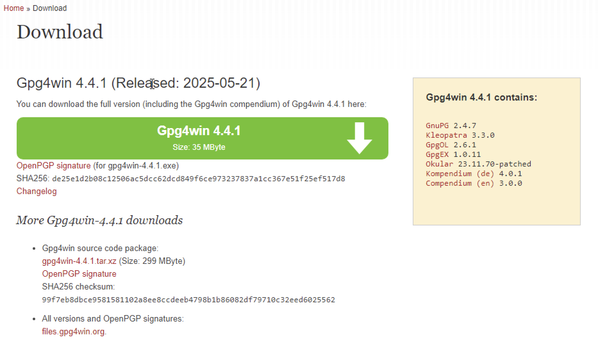
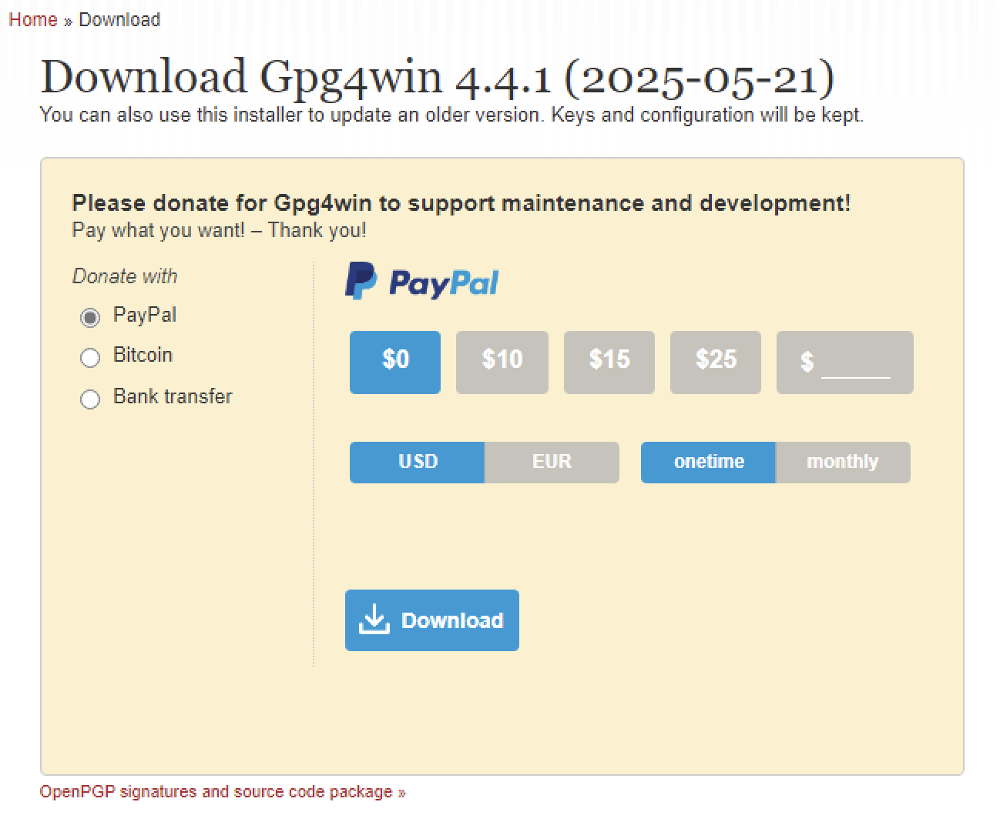
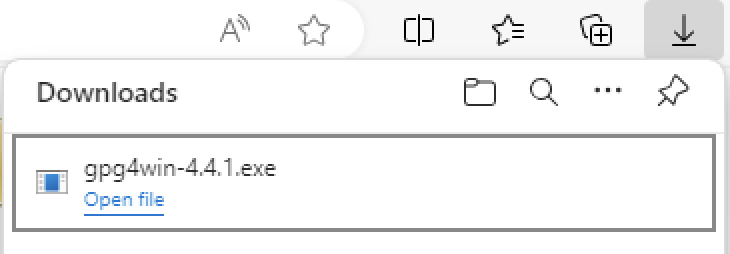
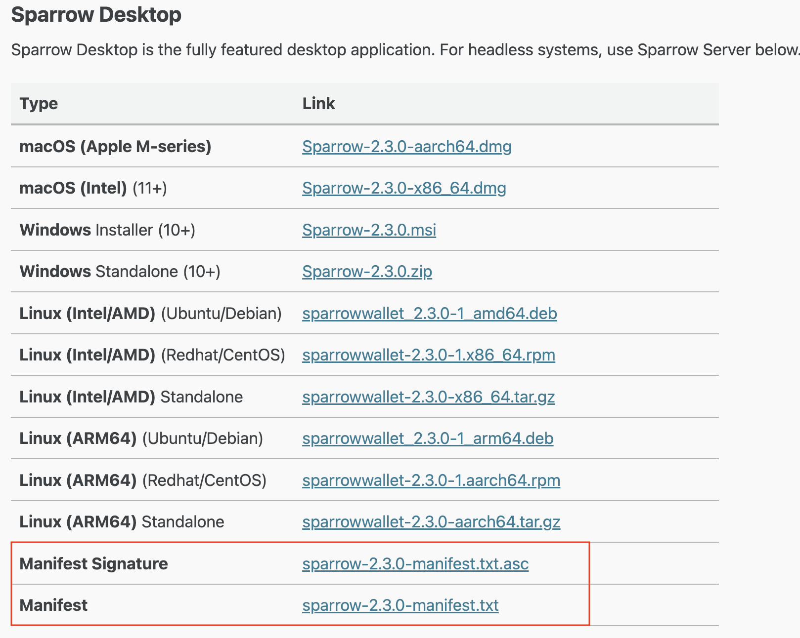

- how to use this doc
  - how to copy cmd in code block
  - how to paste cmd in terminal
- how to use terminal and powershell
  - arrow key to see history cmd
  - tab key to auto complete cmd
- how dif `shasum` and `gpg --verify`
  - `shasum` to verify the file wasn’t corrupted during download
  - `gpg --verify` to confirm the file is authentic and signed by the developer

## install GPG4Win

> if you use MacOS or Linux, GPG is pre-installed you can skip this step

If you use Windows must download GPG4Win before verify signature

### 1. go to [GPG4Win](https://www.gpg4win.org/download.html)

### 2. click Download Gpg4win




### 3. set donate or not (set 0$) and click Download



### 4. click gpg4win-4.4.1.exe to install



### 4. check gpg4win is downloaded

open powershell and type

```powershell
$ gpg --version

gpg (GnuPG) 2.4.8
libgcrypt 1.11.1
Copyright (C) 2025 g10 Code GmbH
License GNU GPL-3.0-or-later <https://gnu.org/licenses/gpl.html>
This is free software: you are free to change and redistribute it.
There is NO WARRANTY, to the extent permitted by law.

Home: C:\Users\phoovich\AppData\Roaming\gnupg
Supported algorithms:
Pubkey: RSA, ELG, DSA, ECDH, ECDSA, EDDSA
Cipher: IDEA, 3DES, CAST5, BLOWFISH, AES, AES192, AES256, TWOFISH,
        CAMELLIA128, CAMELLIA192, CAMELLIA256
Hash: SHA1, RIPEMD160, SHA256, SHA384, SHA512, SHA224
Compression: Uncompressed, ZIP, ZLIB, BZIP2
```

---

## Download and verify Sparrow Wallet

### 1. Download the following files:

- Application
- Signature file
- Manifest file



### 2. Import developer's GPG key

```bash
$ curl https://keybase.io/craigraw/pgp_keys.asc | gpg --import

  % Total    % Received % Xferd  Average Speed   Time    Time     Time  Current
                                 Dload  Upload   Total   Spent    Left  Speed
100  5588  100  5588    0     0   3007      0  0:00:01  0:00:01 --:--:--  3005
gpg: key E94618334C674B40: public key "Craig Raw <craig@sparrowwallet.com>" imported
gpg: Total number processed: 1
gpg:               imported: 1
```

if you use Windows you may be have problem like this

```powershell
$ curl https://keybase.io/craigraw/pgp_keys.asc | gpg --import
gpg: no valid OpenPGP data found.
gpg: Total number processed: 0
```

you can download the key manually and import it

```powershell
$ cd $HOME/Downloads
$ wget https://keybase.io/craigraw/pgp_keys.asc -OutFile craigraw_pgp_keys.asc
$ ls # you should see craigraw_pgp_keys.asc


    Directory: C:\Users\phoovich\Downloads


Mode                 LastWriteTime         Length Name
----                 -------------         ------ ----
-a----         10/5/2025   5:08 AM           5588 craigraw_pgp_keys.asc <-- should see this file
-a----         10/5/2025   4:34 AM       36195976 gpg4win-4.4.1.exe
-a----         10/5/2025   4:26 AM           1543 sparrow-2.3.0-manifest.txt
-a----         10/5/2025   4:26 AM            873 sparrow-2.3.0-manifest.txt.asc
-a----         10/5/2025   4:34 AM      100110336 Sparrow-2.3.0.msi
```

then import the developer's GPG key manually

```powershell
$ gpg --import craigraw_pgp_keys.asc
gpg: C:\\Users\\phoovich\\AppData\\Roaming\\gnupg\\trustdb.gpg: trustdb created
gpg: key E94618334C674B40: public key "Craig Raw <craig@sparrowwallet.com>" imported
gpg: Total number processed: 1
gpg:               imported: 1

```

### 3. verify signature (you can see following in the download page)

**MacOS or Linux**

```bash
$ gpg --verify sparrow-2.3.0-manifest.txt.asc
gpg: assuming signed data in 'sparrow-2.3.0-manifest.txt'
gpg: Signature made Fri Oct  3 16:00:11 2025 +07
gpg:                using RSA key D4D0D3202FC06849A257B38DE94618334C674B40
gpg: Good signature from "Craig Raw <craig@sparrowwallet.com>" [unknown]
gpg: WARNING: This key is not certified with a trusted signature!
gpg:          There is no indication that the signature belongs to the owner.
Primary key fingerprint: D4D0 D320 2FC0 6849 A257  B38D E946 1833 4C67 4B40
```

**Windows (PowerShell)**

```powershell
$ gpg --verify sparrow-2.3.0-manifest.txt.asc
gpg: assuming signed data in 'sparrow-2.3.0-manifest.txt'
gpg: Signature made 10/03/25 02:00:11 Pacific Daylight Time
gpg:                using RSA key D4D0D3202FC06849A257B38DE94618334C674B40
gpg: Good signature from "Craig Raw <craig@sparrowwallet.com>" [unknown]
gpg: WARNING: This key is not certified with a trusted signature!
gpg:          There is no indication that the signature belongs to the owner.
Primary key fingerprint: D4D0 D320 2FC0 6849 A257  B38D E946 1833 4C67 4B40
```

### 4. verify sha256 checksum

**MacOS or Linux**

```bash
$ shasum --check sparrow-2.3.0-manifest.txt --ignore-missing
Sparrow-2.3.0-aarch64.dmg: OK

```

**Windows (PowerShell)**

```powershell
$ CertUtil -hashfile Sparrow-2.3.0.msi SHA256 | findstr /v "hash"
5af72b408dd7e3b1a93cdd7288d6b5dae203c8127dd3f0543a45f13daa10e43a

$ cat sparrow-2.3.0-manifest.txt | findstr Sparrow-2.3.0.msi
5af72b408dd7e3b1a93cdd7288d6b5dae203c8127dd3f0543a45f13daa10e43a *Sparrow-2.3.0.msi

# you should see the same hash value
```
